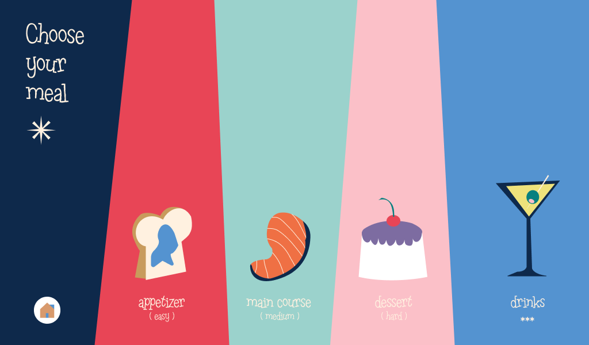

# Color Guessor

Project for Robotics Project II subject of the Robotics AI program, in collaboration with students from the Industrial Design program, Faculty of Architecture.




## Instructions

First, get poetry and pnpm installed in your system.

```bash
pip install poetry
npm install -g pnpm
```

Then, clone the repository and install the dependencies.

```bash
git clone https://github.com/betich/robo2-color-guessor.git
cd robo2-color-guessor
```

Then, install the dependencies in `server` and `color-guesser` directories.

in one terminal:

```bash
cd server
poetry install
```

in another terminal:

```bash
cd color-guesser
poetry install
```

in the other terminal:

```bash
cd client
pnpm install
```

Finally, run the server and the client.

`/server`:

```bash
poetry run start
```

`/color-guesser`:

```bash
poetry run start
```

`/client`:

```bash
pnpm dev
```
